# Aplikacja do rysowania Zbioru Julii

## Opis projektu
Aplikacja została stworzona w Qt i umożliwia interaktywną wizualizację zbioru Julii. Program pozwala użytkownikowi na manipulację widokiem, w tym zbliżanie i oddalanie obrazu, przesuwanie układu współrzędnych, a także dostosowanie parametrów generowania grafiki. Implementacja wykorzystuje programowanie równoległe, co zapewnia efektywne obliczenia.

## Metoda zrównoleglenia obliczeń
Implementacja zrównoleglenia została oparta na podziale pracy pomiędzy wątki, z których każdy przetwarza inną część obrazu (zwaną inaczej blokiem). Wykorzystano standardową bibliotekę C++ do obsługi wątków (std::thread), co umożliwiło na efektywne zarządzanie równoległym wykonywaniem zadań.

<div align="center">
  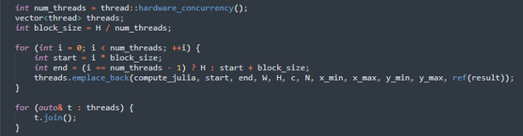
</div>

## Funkcjonalności
- **Zbliżanie i oddalanie przy pomocy scrolla** – zmiana zakresów układu współrzędnych.
- **Przesuwanie widoku** – możliwość eksploracji różnych części zbioru Julii.
- **Ustawienie rozdzielczości obrazu** – wpływa na jakość renderowania.
- **Regulacja wartości N** – liczba iteracji, dla których zachodzi warunek |z_n| < 2.
- **Wybór liczby wątków** – wpływa na szybkość obliczeń i wydajność aplikacji.
- **Edycja parametru c** - możliwość ustawienia części rzeczywistej oraz części urojonej parametru danego zbioru Julii.
- **Przeprowadzenie testu silnej skalowalności** - testy dostępne dla domyślnej liczby wątków oraz dla liczby wątków będących całkowitymi dodatnimi potęgami dwójki mniejszymi od domyślnej liczby wątków.
- **Kolorowe odwzorowanie zbioru** – użycie różnych palet barw (mamy 9 różnych palet kolorów) w zależności od wartości N, dla której nierówność przestaje być spełniona.
- **Wydajność obliczeń** – zastosowanie wielowątkowości dla przyspieszenia generowania obrazu.

## Wymagania systemowe
- **System operacyjny:** Windows / Linux / macOS
- **Biblioteki:** Qt 5/6, CMake
- **Komponenty dodatkowe:** Wątkowość (std::thread)

## Wyniki skalowalności
Wszystkie testy wydajnościowe zostały przeprowadzone w dwóch środowiskach (na komputerze desktopowym i na laptopie). Poniżej znajdują się specyfikacje obu maszyn:

<div align="center">
  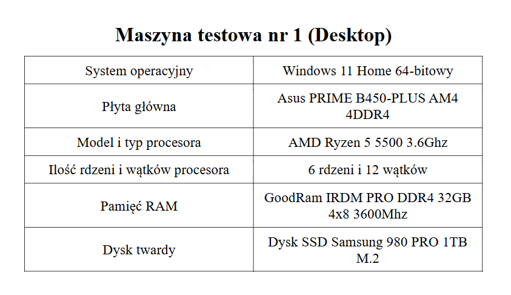
</div>

<div align="center">
  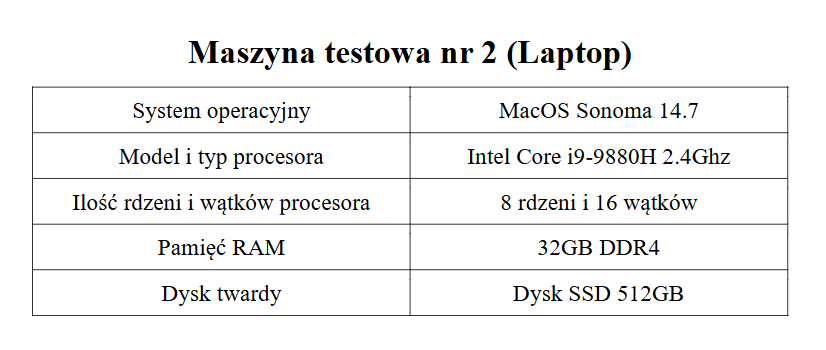
</div>

Do testów porównano czas generowania obrazu zbioru Julii w zależności od liczby używanych wątków (na każdym sprzęcie ustawienie to wygląda nieco inaczej - dla komputera desktopowego był to następujący zestaw wątków: [1, 2, 4, 8, 12], natomiast dla laptopa: [1, 2, 4, 8, 16]). Rzeczą najważniejszą jest oczywiście sprawdzenie skalowalności rozwiązania. Maksymalna liczba iteracji przy każdej próbie wynosiła 100. Wyniki czasu obliczeń mierzono w milisekundach, a każde pomiary powtarzano trzykrotnie, aby uzyskać średnią wartość. Wszystkie wyniki przedstawione zostały z dokładnością do jednego miejsca po przecinku.

Wyniki testów pokazują spadek czasu generowania obrazu wraz ze wzrostem liczby wątków zaangażowanych w obliczenia, co wskazuje na skuteczność zastosowanego zrównoleglenia.Skalowalność na obu maszynach jest szczególnie zauważalna w momencie przejścia z obliczeń z użyciem 8 wątków na maksymalną ich ilość (na desktopie było to 12, a na laptopie 16) oraz z 4 na 8 wątków, natomiast przejście z 2 wątków na 4 wątki nie daje już tak imponujących rezultatów.

Poniżej przedstawiono kilka przykładów wykresów skalowalności dla wygenerowanych obrazów w rozdzielczości 1920x1080 oraz 2560x1920. Wykresy te ilustrują, jak zmienia się czas wykonania obliczeń w zależności od liczby wątków. Do wygenerowania poniższych wykresów użyłem biblioteki matplotlib (skrypt generujący wykresy napisany został z wykorzystaniem języka Python).

**Wykresy dla rozdzielczości 1920x1080**

<div align="center">
  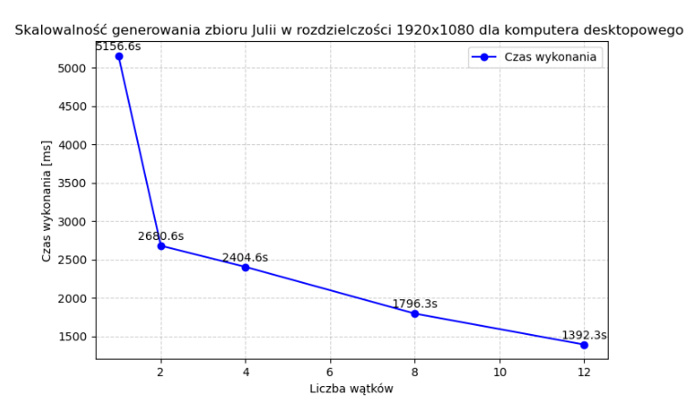
</div>

<div align="center">
  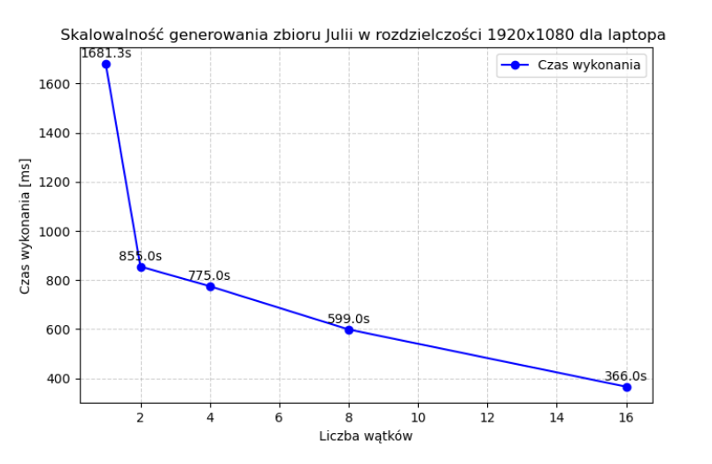
</div>

**Wykresy dla rozdzielczości 2560x1920**

<div align="center">
  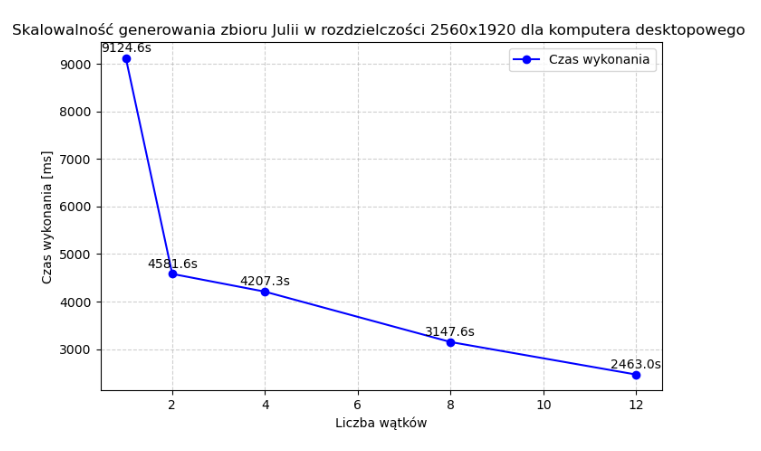
</div>

<div align="center">
  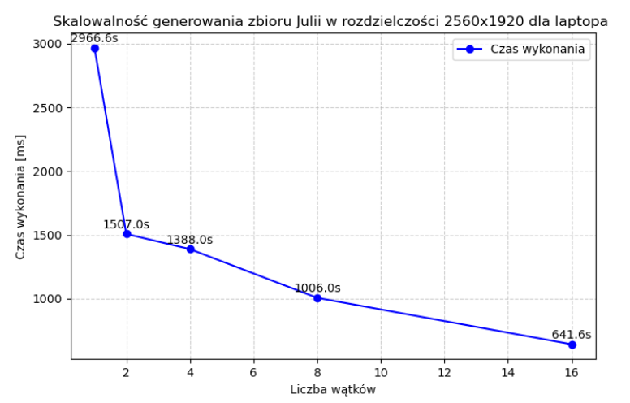
</div>

## Instalacja i uruchomienie
1. **Klonowanie repozytorium:**
   ```sh
   git clone https://github.com/di0xinho/JuliaSet.git
   cd JuliaSet
   ```
2. **Kompilacja projektu:**
   ```sh
   mkdir build && cd build
   cmake ..
   make
   ```
3. **Uruchomienie aplikacji:**
   ```sh
   ./JuliaSet
   ```
4. **Uruchomienie projektu w programie QtCreator:**
   - Otwórz QtCreator.
   - Wybierz opcję **„Otwórz projekt”** i wskaż plik `CMakeLists.txt`.
   - Skonfiguruj kompilator oraz zestaw narzędzi (np. MinGW).
   - Kliknij **„Uruchom”** lub **„Zbuduj i uruchom”**, aby skompilować i uruchomić aplikację.

## Przykłady użycia
- Ustawienie wysokiej rozdzielczości i dużej liczby iteracji dla szczegółowej wizualizacji.
- Eksploracja różnych części zbioru poprzez przesuwanie i skalowanie obrazu.
- Porównanie efektów użycia różnych palet kolorystycznych.

## Ilustracje przedstawiające działanie aplikacji

<div align="center">
  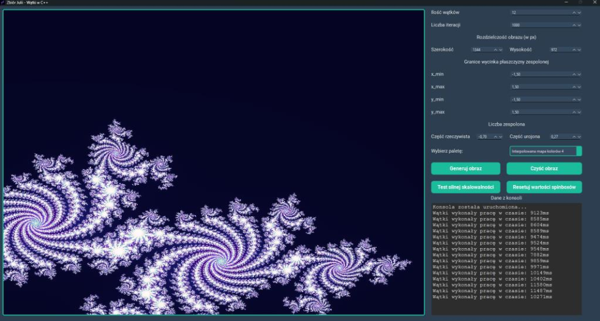
</div>

<div align="center">
  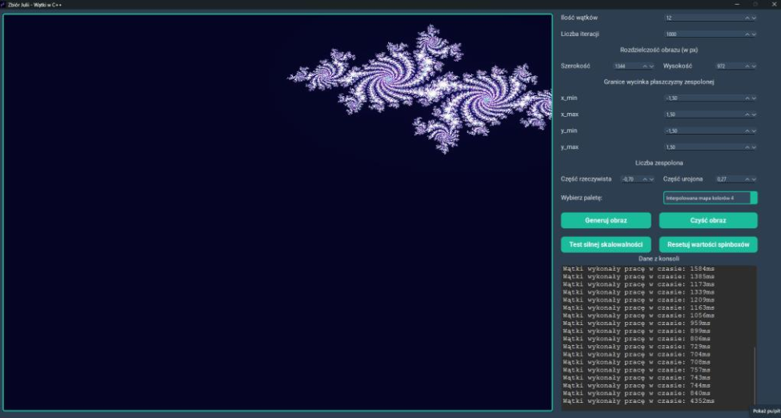
</div>

<div align="center">
  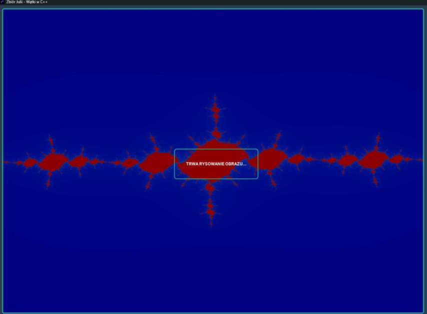
</div>

<div align="center">
  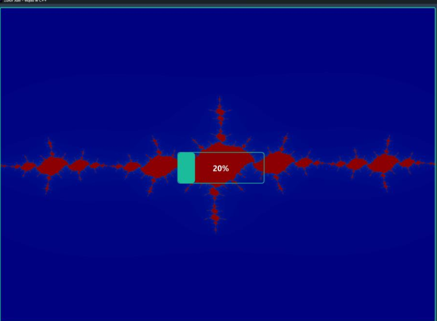
</div>

<div align="center">
  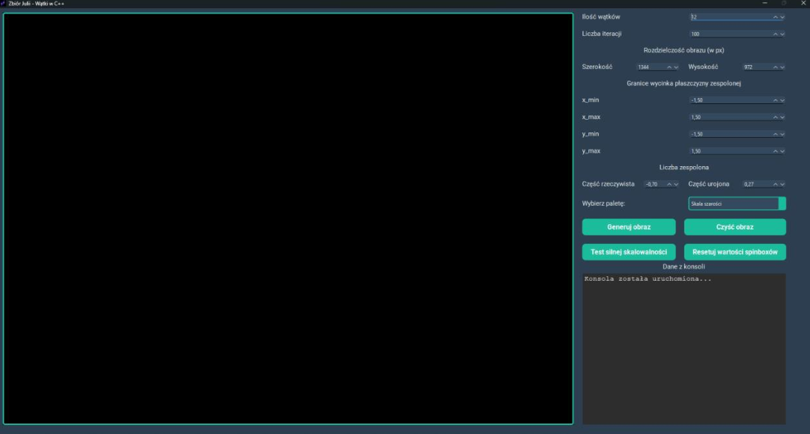
</div>
